# Document-Rag (enterprise stack)

A self-hosted enterprise AI platform: a React SPA plus a microservice backend
covering auth, LiteLLM control plane, Langfuse-fed telemetry, and
agents/workflows/knowledge CRUD. Everything runs under `docker compose`;
Kubernetes/Terraform come later.

## Services

| Container | Role |
| --- | --- |
| `web` (nginx) | SPA + reverse proxy for `/api`, `/auth` |
| `auth-service` | Username/password login, JWT (`realm_access.roles`), user CRUD |
| `api-service` | Public BFF: JWT verify, SlowAPI rate limit, LiteLLM + Langfuse proxy, telemetry rollups |
| `agent-service` | Agents / workflows / guardrails CRUD (Postgres JSONB) |
| `execution-service` | LangGraph runner; every call emits a Langfuse trace |
| `knowledge-service` | Knowledge hubs + RAG profiles CRUD |
| `ingestion-worker` | TaskIQ worker (PyMuPDF / OCR / embeddings - stub today) |
| `worker-service` + `worker-scheduler` | TaskIQ worker + scheduler; Langfuse -> Postgres rollup job every 15 min |
| `postgres` | Databases `eai` (app services) and `litellm` (LiteLLM Prisma schema only) |
| `postgres-langfuse` | Dedicated DB for Langfuse |
| `redis` | Sessions, SlowAPI counters, TaskIQ broker |
| `minio` (+ init) | S3-compatible object store (buckets: `uploads`, `extracts`, `exports`, `langfuse`) |
| `litellm` | Model gateway (master key stays server-side) |
| `langfuse-web` | Self-hosted Langfuse UI on `:3003` |

## Bring the stack up

```bash
cp infra/litellm/.env.example infra/litellm/.env       # add OPENAI / ANTHROPIC keys
cp infra/langfuse/.env.example infra/langfuse/.env     # set NEXTAUTH_SECRET / SALT
cp apps/web/.env.example apps/web/.env.local           # opt into backend features

docker compose up --build
```

Then:

1. Visit http://localhost:3003 and create the Langfuse org/project.
2. Copy the public/secret key pair back into `infra/langfuse/.env`.
3. `docker compose up -d api-service execution-service worker-service worker-scheduler` to pick up the keys.
4. Open http://localhost:8080 - log in as `admin / admin`, `developer / developer`, or `user / user`.

## Admin features in the SPA (admins only)

Settings ->
- **Models** - manage the LiteLLM catalog (`/model/new`, `/model/delete`, `/model/info`)
- **Virtual keys** - generate/revoke LiteLLM keys (`/key/generate`, `/key/delete`)
- **Budgets** - per-key/per-team budgets (`/budget/*`)
- **Observability** - live Langfuse traces with drill-down (span tree, metadata)

The **Telemetry** page shows real cost/request/token rollups broken down by user / agent / workflow, served by api-service from the `usage_daily` table (populated by `worker-scheduler`).

## Feature flags

`apps/web/.env.local`:

```
VITE_USE_BACKEND=1          # auth + API; agents, workflows, hubs, RAG profiles, tools, policies, NeMo rails, chat → Postgres
```

## Local-only (no backend)

Drop `VITE_USE_BACKEND` and run only the SPA:

```bash
cd apps/web && npm install && npm run dev
```

The SPA falls back to localStorage for users, agents, workflows, knowledge, etc.


---

## Architecture

Single document describing the enterprise AI platform architecture. It
combines what used to be four files (`overview`, `diagram-extensions`, `nfr`,
`sequence-flows`) so you can read top to bottom in one place.

### Contents

1. [Overview](#1-overview)
   - 1.1 [Layered view (six rubric layers)](#11-layered-view-six-rubric-layers)
   - 1.2 [Critical-path flow (chat with RAG)](#12-critical-path-flow-chat-with-rag)
   - 1.3 [Async ingestion path](#13-async-ingestion-path)
   - 1.4 [Where things live in the repo](#14-where-things-live-in-the-repo)
2. [Diagram extensions (overlays)](#2-diagram-extensions-overlays)
   - 2.1 [Tenant / workspace boundary and policy enforcement](#21-tenant--workspace-boundary-and-policy-enforcement)
   - 2.2 [Async ingestion vs synchronous inference](#22-async-ingestion-vs-synchronous-inference)
   - 2.3 [Data lifecycle swimlane](#23-data-lifecycle-swimlane)
   - 2.4 [Service identity (mTLS) east-west](#24-service-identity-mtls-east-west)
   - 2.5 [Model lifecycle (staging, eval, promotion)](#25-model-lifecycle-staging-eval-promotion)
   - 2.6 [Correlation tracing across services](#26-correlation-tracing-across-services)
   - 2.7 [Applying overlays to the architecture](#27-applying-overlays-to-the-architecture)
3. [Non-functional requirements (NFR)](#3-non-functional-requirements-nfr)
   - 3.1 [Service-level objectives (SLO)](#31-service-level-objectives-slo)
   - 3.2 [Availability and disaster recovery](#32-availability-and-disaster-recovery)
   - 3.3 [Data retention and residency](#33-data-retention-and-residency)
   - 3.4 [Security and compliance posture](#34-security-and-compliance-posture)
   - 3.5 [Capacity and cost](#35-capacity-and-cost)
   - 3.6 [Environments](#36-environments)
   - 3.7 [Open items / explicit non-goals (today)](#37-open-items--explicit-non-goals-today)
4. [Sequence flows](#4-sequence-flows)
   - 4.1 [Authenticated chat with RAG](#41-authenticated-chat-with-rag)
   - 4.2 [Document upload and indexing](#42-document-upload-and-indexing)
   - 4.3 [Admin model change with audit and canary](#43-admin-model-change-with-audit-and-canary)
   - 4.4 [Using these flows with the layered view](#44-using-these-flows-with-the-layered-view)

Legend used throughout:

- Solid arrows = synchronous request/response (HTTP).
- Dashed arrows = async / message / scheduled (TaskIQ over Redis).
- Dotted arrows = telemetry/observability writes.
- Boxes named after services map 1:1 to containers in `docker-compose.yml`.

---

## 1. Overview

End-to-end picture of the platform as it exists in this repository today.
Section 1.1 is the primary layered view; the rest of this document adds
cross-cutting detail and operational tables.

### 1.1 Layered view (six rubric layers)

```mermaid
flowchart TB
  %% =====================================================================
  %% 1. USER & ACCESS
  %% =====================================================================
  subgraph L1 [1 - User and Access]
    direction LR
    Users["Internal users<br/>(admin / developer / user)"]
    APIClient["API clients<br/>(scripts, integrations)"]
  end

  %% =====================================================================
  %% 2. APPLICATION / SERVICE
  %% =====================================================================
  subgraph L2 [2 - Application and Service layer]
    direction TB
    Nginx["Edge gateway<br/>nginx (eai-web)<br/>:8080"]
    SPA["React SPA<br/>(served by nginx)"]
    subgraph CorePlane [Core backend services]
      direction LR
      Auth["auth-service<br/>FastAPI<br/>JWT, RBAC, users"]
      API["api-service<br/>FastAPI + SlowAPI<br/>public API, LiteLLM proxy,<br/>telemetry rollups"]
      Agent["agent-service<br/>agents / workflows /<br/>guardrails CRUD"]
      Knowledge["knowledge-service<br/>knowledge hubs,<br/>RAG profiles"]
      Exec["execution-service<br/>chat orchestration<br/>(LangGraph-ready)"]
    end
  end

  %% =====================================================================
  %% 3. AI / PROCESSING
  %% =====================================================================
  subgraph L3 [3 - AI and Processing]
    direction LR
    LiteLLM["LiteLLM<br/>model gateway<br/>+ virtual keys + budgets"]
    Guardrails["Guardrails<br/>(NeMo Guardrails - planned)"]
    Embed["Embedding endpoints<br/>(via LiteLLM)"]
    OCR["OCR / parsing<br/>PyMuPDF, Surya<br/>(in ingestion-worker)"]
    subgraph Providers [LLM providers]
      OpenAI["OpenAI"]
      Anthropic["Anthropic"]
      OtherLLM["others..."]
    end
  end

  %% =====================================================================
  %% 4. DATA
  %% =====================================================================
  subgraph L4 [4 - Data]
    direction LR
    PG_App["Postgres :5432<br/>db = eai<br/>(users, agents, workflows,<br/>guardrails, hubs, rag_profiles,<br/>usage_daily, traces_index)"]
    PG_LiteLLM["Postgres :5432<br/>db = litellm<br/>(LiteLLM_* tables)"]
    PG_LF["Postgres-langfuse :5432<br/>db = langfuse"]
    Redis["Redis :6379<br/>sessions, queues,<br/>SlowAPI counters"]
    MinIO["MinIO :9000/:9001<br/>S3-compatible<br/>(uploads, audit)"]
    Vector["Vector store<br/>LanceDB / pgvector<br/>(planned)"]
  end

  %% =====================================================================
  %% 5. ASYNC PROCESSING
  %% =====================================================================
  subgraph L5 [5 - Async processing]
    direction LR
    Ingest["ingestion-worker<br/>TaskIQ"]
    Worker["worker-service<br/>TaskIQ<br/>(Langfuse pull, rollups)"]
    Sched["worker-scheduler<br/>TaskIQ scheduler<br/>(15 min Langfuse sync)"]
  end

  %% =====================================================================
  %% 6. PLATFORM / OBSERVABILITY / GOVERNANCE
  %% =====================================================================
  subgraph L6 [6 - Platform, Observability, Security]
    direction LR
    Langfuse["Langfuse :3003<br/>LLM traces, evals,<br/>cost / usage"]
    Audit["Audit log<br/>(MinIO object-lock)"]
    Secrets["Secrets<br/>infra/*/.env, Vault<br/>(planned)"]
    CICD["CI/CD<br/>build, test, sign<br/>(planned)"]
    IaC["IaC + GitOps<br/>(planned: K8s, Helm)"]
  end

  %% --------------------- Edges -----------------------------------------
  Users -->|HTTPS| Nginx
  APIClient -->|HTTPS + Bearer JWT| Nginx
  Nginx -->|/| SPA
  Nginx -->|/auth/*| Auth
  Nginx -->|/api/*| API

  API -->|JWT verify| Auth
  API --> Agent
  API --> Knowledge
  API --> Exec
  API -->|admin REST<br/>master key| LiteLLM
  API -.->|GET traces / metrics| Langfuse
  API --> PG_App
  API --> Redis

  Auth --> PG_App
  Agent --> PG_App
  Knowledge --> PG_App

  Exec --> Guardrails
  Exec --> Knowledge
  Exec --> LiteLLM
  Exec -.->|trace + cost| Langfuse

  LiteLLM --> Providers
  LiteLLM --> PG_LiteLLM
  Embed --> Providers

  Knowledge --> MinIO
  Knowledge --> Vector

  SPA -->|file upload| Nginx
  Nginx -->|/api/v1/uploads| API
  API -->|enqueue| Redis
  Redis -. deliver task .-> Ingest
  Ingest --> MinIO
  Ingest --> OCR
  Ingest --> Embed
  Ingest --> Vector
  Ingest -.->|trace| Langfuse

  Sched -. cron .-> Worker
  Worker -.->|GET /api/public/traces| Langfuse
  Worker --> PG_App

  Langfuse --> PG_LF

  %% Cross-cutting (governance)
  Audit -. append-only .- API
  Audit -. append-only .- Auth
  Audit -. append-only .- LiteLLM

  classDef plane fill:#0b1020,stroke:#445,color:#cfd6e4
  classDef store fill:#152033,stroke:#345,color:#cfd6e4
  classDef ai    fill:#1a2238,stroke:#456,color:#cfd6e4
  class L1,L2,L3,L5,L6 plane
  class L4 store
  class LiteLLM,Guardrails,Embed,OCR,Providers ai
```

Notes on what is **implemented today** vs. **planned**:

- Implemented: nginx edge, SPA, auth-service, api-service, agent-service,
  knowledge-service, execution-service, LiteLLM with separate `litellm` DB,
  Postgres for app + Langfuse, Redis, MinIO, TaskIQ workers and scheduler,
  Langfuse self-hosted.
- Planned (not yet implemented in this repo): NeMo Guardrails,
  LanceDB/pgvector wiring in `knowledge-service`, audit log object-lock,
  Vault, full CI/CD, K8s + IaC.

### 1.2 Critical-path flow (chat with RAG)

This is the same content as section 4.1, summarized so the single-page
reader sees the happy path without scrolling away.

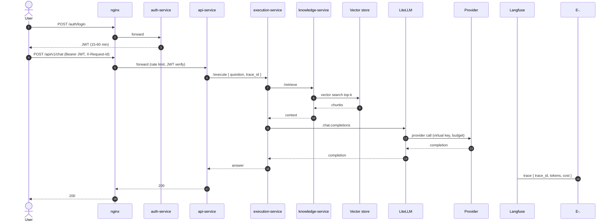

### 1.3 Async ingestion path

Decoupled from the chat path so a 50 MB PDF upload never starves a chat
request. Section 4.2 has the full sequence diagram.

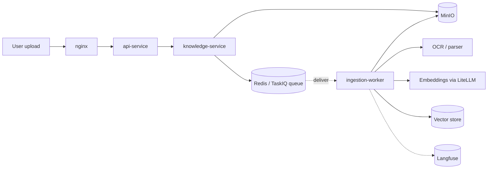

### 1.4 Where things live in the repo

| Component (section 1.1) | Path |
|---|---|
| Edge gateway (nginx) | `infra/nginx/` |
| React SPA | `apps/web/` |
| auth-service | `services/auth-service/` |
| api-service | `services/api-service/` |
| agent-service | `services/agent-service/` |
| knowledge-service | `services/knowledge-service/` |
| execution-service | `services/execution-service/` |
| ingestion-worker | `services/ingestion-worker/` |
| worker-service / scheduler | `services/worker-service/` |
| LiteLLM config | `infra/litellm/` |
| Langfuse env | `infra/langfuse/` |
| Postgres init (3 DBs: eai / langfuse / litellm) | `infra/postgres/init/01-init.sql` |
| Shared Python utilities | `libs/python/eai_common/` |
| Compose stack | `docker-compose.yml` |

---

## 2. Diagram extensions (overlays)

Swimlanes, boundaries, and labels that extend the layered view (section 1.1)
for cross-cutting concerns: multi-tenancy, data lifecycle, async vs sync paths,
service identity, model lifecycle, and correlation tracing.

Each subsection is one additive overlay. The mermaid blocks are reference
views; render them here or reproduce the same structure in your own docs.

### 2.1 Tenant / workspace boundary and policy enforcement

Wrap end-user resources inside a `Workspace` boundary and mark every place
where a policy is evaluated. Use three colored badges on one view:

- `A` = Authentication (who you are)
- `Z` = Authorization / RBAC (what you can do)
- `Q` = Quota / rate limit (how much you may do)

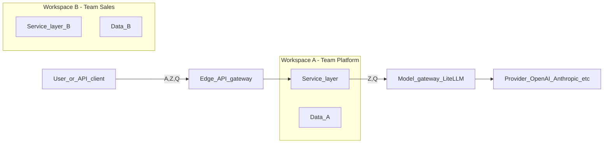

**Design notes**

- Use one rounded rectangle per workspace; never let arrows cross workspace
  boundaries except through the **Edge API gateway** or the **Model gateway**.
- Show **per-tenant** virtual keys / model allowlists at the Model gateway box.

### 2.2 Async ingestion vs synchronous inference

When the layered view shows only a single happy path, split it explicitly:

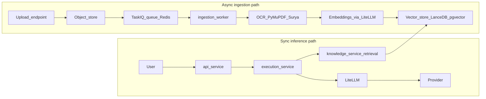

Notes:

- Annotate **SLOs** on the sync path (e.g. p95 chat ≤ 4s) and **throughput**
  on the async path (e.g. 200 docs/min sustained).
- Mark **idempotency keys** on `upload`, `queue`, and `ingest`.

### 2.3 Data lifecycle swimlane

Add a horizontal lifecycle band under the layered view (section 1.1):

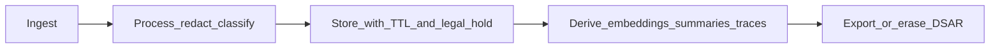

Annotations for each store:

- `Postgres operational`: PII columns flagged, daily backup, 35-day PITR, RPO 5m / RTO 30m.
- `Postgres Langfuse`: trace TTL 90 days, monthly export to cold storage.
- `MinIO/S3`: object-lock for `audit/`, lifecycle to Glacier after 180 days.
- `Vector store`: rebuildable from sources; no PII; nightly snapshot.

### 2.4 Service identity (mTLS) east-west

Distinguish **human identity** (SSO/OIDC) at the edge from **service identity**
between internal services:

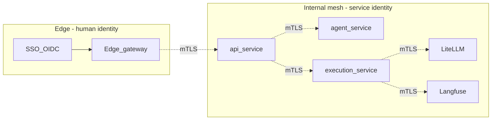

Notes:

- Label the mesh (Linkerd / Istio / consul-connect) and the certificate issuer
  (e.g. cert-manager + an internal CA).
- Mark **break-glass** access with a dashed line from an `OpsAdmin` actor into
  the mesh through a bastion / SSM Session.

### 2.5 Model lifecycle (staging, eval, promotion)

Models move through environments before they appear in production dropdowns:

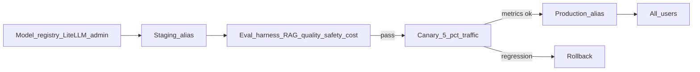

Notes:

- Annotate **who** can move from staging to canary (Platform Admin) vs canary
  to prod (Platform Admin + 1 approver).
- Wire the eval harness output into the **Audit log**.

### 2.6 Correlation tracing across services

Add one `correlation_id` column on every box and one shared collector:

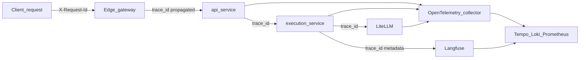

Notes:

- The `trace_id` injected by the gateway should equal the Langfuse `trace.id`
  used by `execution-service`, so a single ID joins **HTTP traces**,
  **logs**, and **LLM traces**.

### 2.7 Applying overlays to the architecture

1. Start from the layered view (section 1.1).
2. Treat each subsection in section 2 as an optional overlay on that view
   (tenancy, sync vs async, lifecycle, mTLS, model lifecycle, tracing).
3. Cross-reference each overlay to the components it annotates in section 1.1.
4. Keep the legend (`A` / `Z` / `Q` badges, mTLS dashed line, lifecycle band)
   defined once (for example in a glossary or figure caption).

---

## 3. Non-functional requirements (NFR)

Companion tables to the architecture overview (section 1.1). Numbers are **target** values
for the production environment; staging is one tier below, dev is best-effort.

### 3.1 Service-level objectives (SLO)

| Capability | Indicator (SLI) | Target (SLO) | Error budget | Notes |
|---|---|---|---|---|
| Web portal | HTTP 5xx rate on `GET /` | < 0.1% | 30d rolling | Static assets via CDN. |
| Edge gateway | p95 latency, healthy upstream | < 150 ms | 30d rolling | Excludes LLM time. |
| Chat (sync) | p95 end-to-end response | < 4.0 s | 99.0% / 30d | With RAG, single tool call. |
| Chat (sync) | p99 end-to-end response | < 8.0 s | 99.0% / 30d | Cold-start tolerant. |
| Q&A retrieval | p95 vector search | < 250 ms | 99.5% / 30d | Top-k = 8, HNSW. |
| Document ingest | Time to "indexed" for ≤ 50 MB PDF | < 90 s p95 | 99.0% / 30d | Async pipeline. |
| Auth | p95 login | < 600 ms | 99.9% / 30d | Includes JWT mint. |
| Admin APIs | Availability | 99.5% / 30d | — | Read-only fallback if model gateway down. |
| Telemetry pull | Lag from Langfuse to local rollups | < 20 min | 99% / 30d | Scheduled every 15 min. |

### 3.2 Availability and disaster recovery

| Component | Availability target | RPO | RTO | Strategy |
|---|---|---|---|---|
| Edge gateway (Nginx) | 99.95% | n/a | < 5 min | Stateless, multi-replica behind LB. |
| `api-service`, `auth-service`, `agent-service`, `knowledge-service` | 99.9% | n/a | < 10 min | Stateless, ≥ 2 replicas, rolling deploy. |
| `execution-service` | 99.5% | n/a | < 10 min | Degrades to "model gateway down" banner. |
| Postgres (operational) | 99.95% | 5 min | 30 min | Managed PG with PITR; standby in second AZ. |
| Postgres (Langfuse) | 99.5% | 60 min | 60 min | Daily logical backup; trace loss tolerable. |
| Redis (sessions / queues) | 99.9% | 5 min (AOF) | 15 min | Replica + sentinel; queues are idempotent. |
| MinIO / S3 | 99.99% | 0 (versioning) | 30 min | Object lock on `audit/`; cross-region replication for prod. |
| Vector store | 99.5% | rebuildable | 4 h | Snapshot nightly; full rebuild from sources is a documented runbook. |
| LiteLLM | 99.5% | n/a | 10 min | Stateless except DB; failover to second region or self-host fallback model. |
| Langfuse | 99.0% | 60 min | 60 min | Loss of traces does not block user traffic. |

### 3.3 Data retention and residency

| Data class | Store | Default retention | Legal hold | Residency |
|---|---|---|---|---|
| User accounts | Postgres `auth.users` | Account lifetime + 90 d | Yes | Primary region only. |
| Conversations | Postgres `app.conversations` | 180 d (configurable per workspace) | Yes | Workspace region. |
| Uploaded files | MinIO `uploads/{workspace}/` | 365 d, then archive 5 y | Yes | Workspace region; never replicated cross-border without policy. |
| Derived embeddings | Vector store | Linked to source TTL | No | Same as source. |
| LLM traces | Postgres Langfuse | 90 d hot, 1 y cold export | No (PII redacted) | Primary region. |
| Cost / usage rollups | Postgres `app.usage_daily` | 36 months | No | Primary region. |
| Audit log | MinIO `audit/` (object-locked) | 7 y | Yes | Primary region. |
| Secrets | Vault / SSM | Lifetime of credential | n/a | Primary region. |

PII handling: classification on ingest, redaction in `execution-service` before
prompts hit external providers, DSAR (export / erase) job in `worker-service`.

### 3.4 Security and compliance posture

| Control | Requirement | Implementation |
|---|---|---|
| Authentication | OIDC / SSO at the edge | `auth-service` issues short-lived JWT (15 min), refresh in Redis. |
| Authorization | RBAC: `admin`, `developer`, `user`; per-workspace scopes | Enforced at gateway and re-checked per service. |
| Service identity | mTLS between internal services | Mesh (Linkerd or Istio) once on Kubernetes; cert-manager + internal CA. |
| Secrets | No plaintext at rest; rotated every 90 d | Vault / AWS Secrets Manager; sealed-secrets in GitOps repo. |
| Supply chain | Signed images, SBOM, dep scan | cosign + syft + Trivy in CI. |
| Runtime | Pod security baseline, network policies | OPA/Gatekeeper or Kyverno; default-deny network. |
| LLM safety | Prompt injection, tool abuse, output filter | Guardrails service (NeMo Guardrails) in front of `execution-service`. |
| Audit | Immutable, queryable, 7-year retention | Append-only stream to MinIO with object lock; mirrored to SIEM. |
| Privacy | DSAR ≤ 30 days | `worker-service` task triggered by admin endpoint. |

### 3.5 Capacity and cost

| Dimension | Sizing | Cost guardrail |
|---|---|---|
| Concurrent chat sessions | 500 sustained, 2 000 burst | LiteLLM virtual key budgets per workspace. |
| Documents ingested | 50 000 / month, avg 5 MB | TaskIQ concurrency cap; per-workspace daily quota. |
| LLM spend | Tracked daily by workspace, model, env | Hard cap via LiteLLM budget; alert at 80%. |
| Vector store size | 50 M vectors (1536 d) | Sharded; scheduled rebuild job. |
| Storage | 5 TB hot, 50 TB cold | Lifecycle policies; archive after 180 d. |

Cost is allocated by **workspace × environment × model** so finance can
chargeback per business unit; raw provider invoices reconcile monthly.

### 3.6 Environments

| Concern | Dev | Staging | Production |
|---|---|---|---|
| Topology | docker-compose (this repo) | Single-region K8s, 1 AZ | Multi-AZ K8s, multi-region for stateful where listed above |
| Data | synthetic / scrubbed | scrubbed copy of prod (no PII) | live |
| Models | mocked + cheap providers | full provider list, low budget | full list, normal budget |
| Access | engineers only | engineers + selected business reviewers | end users |
| Change control | self-serve | PR review | PR review + change ticket + approver |

### 3.7 Open items / explicit non-goals (today)

- Multi-region active/active for stateful services (Postgres, Vector). Today
  warm-standby in a second AZ; cross-region is documented, not yet wired.
- On-prem provider connectivity (private VPC peering to enterprise systems)
  is in scope but credentials/network plan tracked separately.
- DuckDB analytics surface deferred to phase 2; rollups in Postgres are
  sufficient for the assessment.

---

## 4. Sequence flows

Three end-to-end flows that the layered overview (section 1.1) does not spell out step by step.
Together they prove the platform handles **synchronous chat with retrieval**,
**asynchronous ingestion**, and **governed admin changes**.

Every flow propagates a single `trace_id` (the gateway's `X-Request-Id`)
across services so logs, HTTP traces, and Langfuse traces can be joined.

### 4.1 Authenticated chat with RAG

User asks a question through the web portal; the platform retrieves context
from the workspace knowledge hub, calls an LLM via LiteLLM, records the trace
in Langfuse, and returns the answer.

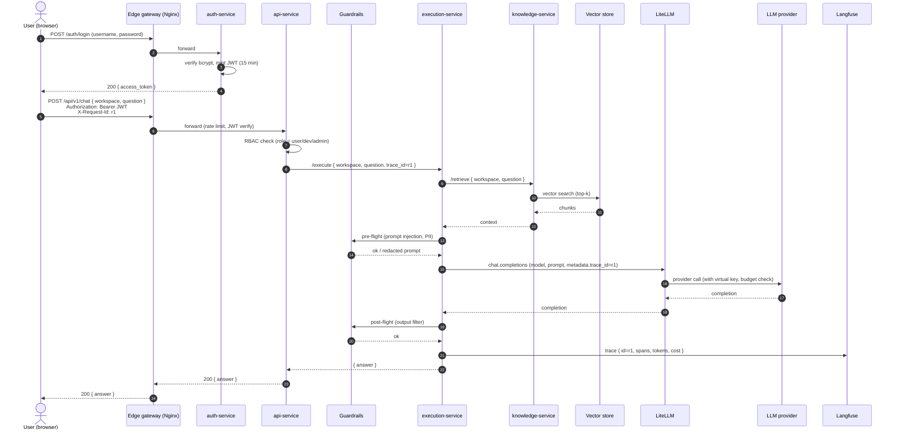

Failure / degradation notes:

- If `knowledge-service` or vector store is down, `execution-service` falls
  back to **no-context** mode and tags the trace `degraded=retrieval_off`.
- If LiteLLM rejects (budget exceeded), `api-service` returns `429` with a
  workspace-friendly message.
- If Langfuse is unreachable, the trace is buffered locally for 1 h before
  being dropped; user traffic is never blocked on telemetry.

### 4.2 Document upload and indexing

User uploads a file; the platform stores it in object storage, queues an
ingestion task, extracts text, generates embeddings, and writes vectors back
to the workspace index.

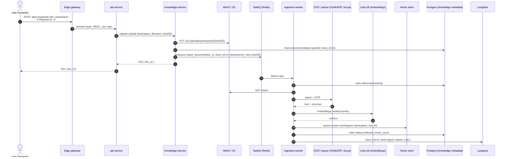

Notes:

- The `idempotency_key` is the file's `sha256`; replays of the same upload
  are no-ops and never double-charge.
- The user can poll `GET /api/v1/uploads/{doc_id}` (served by `knowledge-service`
  via `api-service`) to see `queued → processing → indexed` or `failed`.
- Failures move the task to a dead-letter queue; the SPA shows a "retry"
  button that re-enqueues with the same idempotency key.

### 4.3 Admin model change with audit and canary

A platform admin promotes a new provider/model into the catalog. The change
is governed: it requires elevated role, lands in **staging** first, runs the
eval harness, optionally canaries, and only then becomes visible to all
workspaces. Every step is auditable.

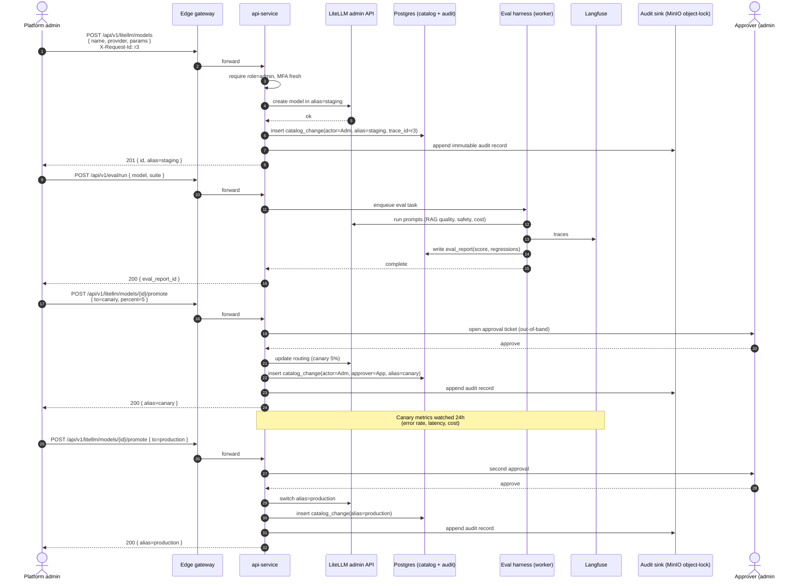

Notes:

- Every transition (`staging → canary → production`) requires a second admin
  approval and is appended to the **object-locked** audit bucket; rollback
  is a single API call that flips the alias and writes another audit record.
- If canary metrics regress (Langfuse-derived error rate or p95), the
  `worker-service` watcher posts a warning to the admin and disables the
  promote endpoint until acknowledged.
- End users never see staging or canary models unless their workspace is
  explicitly opted in via virtual-key tags.

### 4.4 Using these flows with the layered view

1. Treat each flow above (chat with RAG, upload and index, admin model change)
   as a separate narrative or appendix when you explain the system.
2. Keep actor and service names aligned with the boxes in section 1.1 so each
   step maps to a concrete component.
3. Use `X-Request-Id` / `trace_id` consistently between HTTP traces and
   Langfuse (see section 2.6).
