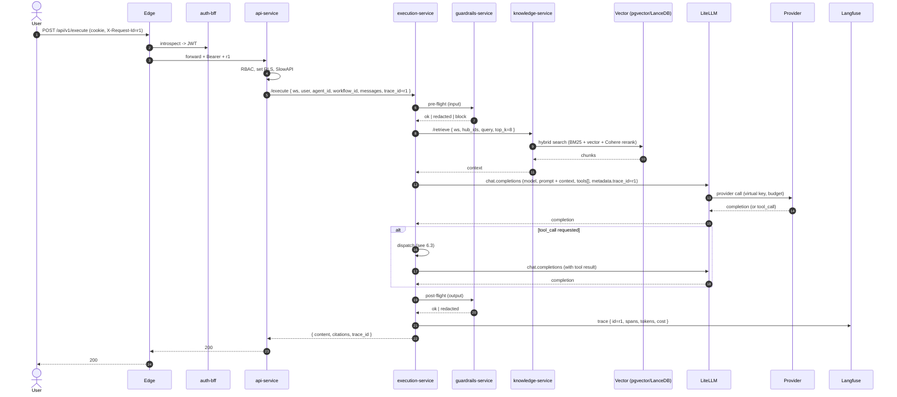
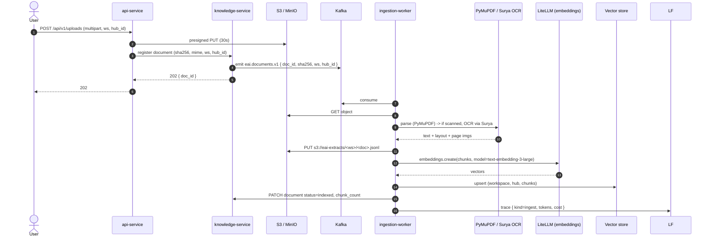
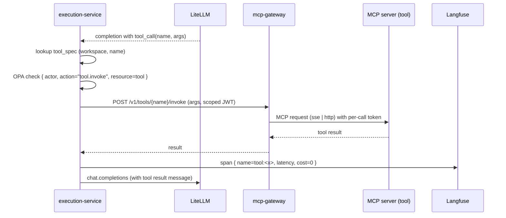
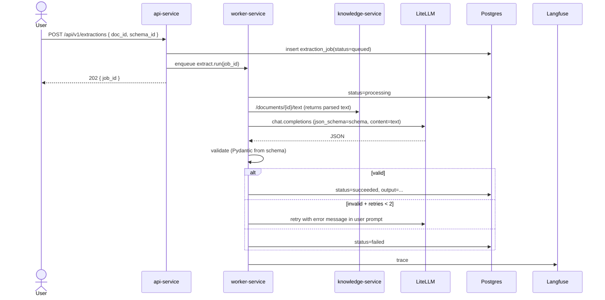

# Enterprise AI Platform — Implementation System Design

> Companion document to the high-level architecture in
> [`README.md` § Architecture](../README.md#architecture). This file is the
> **implementation-grade** specification: it closes every gap identified in
> the Konovo *Advanced Architecture Assessment* and maps the six rubric
> layers (User/Access, Service, AI/Processing, Data, Platform, Governance)
> to concrete services, schemas, code interfaces, infra, and a phased
> rollout against the current repo.
>
> **Status of this document:** target architecture (T+12 weeks). Sections
> tagged **\[Built]** match `main` today; **\[Plan]** describes the
> implementation needed to reach 100% of the brief.

---

## Table of contents

1. [Goals, non-goals, and acceptance criteria](#1-goals-non-goals-and-acceptance-criteria)
2. [Top-level architecture (six-layer view)](#2-top-level-architecture-six-layer-view)
3. [Tenancy, identity, and authorization model](#3-tenancy-identity-and-authorization-model)
4. [Service catalog and responsibilities](#4-service-catalog-and-responsibilities)
5. [Data model (canonical schemas)](#5-data-model-canonical-schemas)
6. [End-to-end flows](#6-end-to-end-flows)
   - 6.1 Chat with RAG (sync)
   - 6.2 Document ingestion (async)
   - 6.3 Tool / MCP call inside an agent step
   - 6.4 Structured extraction job
   - 6.5 Image / multimodal understanding
   - 6.6 Admin model lifecycle (staging → canary → prod)
7. [AI / Processing layer](#7-ai--processing-layer)
8. [Data layer](#8-data-layer)
9. [Platform / infrastructure](#9-platform--infrastructure)
10. [Observability and SRE](#10-observability-and-sre)
11. [Security and governance controls](#11-security-and-governance-controls)
12. [CI/CD, supply chain, and GitOps](#12-cicd-supply-chain-and-gitops)
13. [Environments and promotion](#13-environments-and-promotion)
14. [Phased rollout from the current repo](#14-phased-rollout-from-the-current-repo)
15. [Appendix A — API surface (authoritative list)](#appendix-a--api-surface-authoritative-list)
16. [Appendix B — ADRs (architecture decision records)](#appendix-b--adrs-architecture-decision-records)

Legend: solid arrows = sync HTTP, dashed = async (TaskIQ/Kafka), dotted =
telemetry. Boxes named after services map 1:1 to a deployable unit.

---

## 1. Goals, non-goals, and acceptance criteria

### 1.1 Goals

The platform is a **multi-tenant, cloud-native AI workbench** that lets
internal teams build, govern, and consume four families of AI capabilities
through a single web portal and REST API:

1. **Chat agents** — multi-turn conversations with persona, tools, memory.
2. **Q&A over enterprise knowledge** — retrieval-augmented generation
   against per-workspace document corpora.
3. **Structured extraction from documents** — schema-driven extraction
   pipelines producing validated JSON.
4. **Image / multimodal understanding** — vision-capable models reasoning
   over uploaded images and PDFs.

All four flow through one **model gateway** (LiteLLM) with per-workspace
virtual keys, budgets, and an immutable audit log.

### 1.2 Non-goals (explicit)

- Public, unauthenticated AI endpoints.
- Self-hosting open-weights LLMs in this platform (delegated to a sister
  inference cluster reachable via LiteLLM).
- Replacing existing data warehouses; rollups land in Postgres and stream
  out via CDC.

### 1.3 Acceptance criteria mapped to the six rubric layers

| Layer | Acceptance criterion |
|---|---|
| 1. User & Access | OIDC SSO + MFA at the edge; RBAC with `admin` / `developer` / `user` and per-workspace scopes; JWTs verified by every service. |
| 2. Application | Single API gateway; ≥ 7 microservices with clear ownership; agent orchestration (LangGraph) with prompt + execution mgmt; conversation persistence; file upload; provider-agnostic model layer. |
| 3. AI / Processing | LLM providers behind LiteLLM; embeddings, vector RAG, tool calling, OCR, multimodal — all live; MCP tool federation. |
| 4. Data | Operational DB (Postgres), vector DB (pgvector + LanceDB hot tier), object storage (S3/MinIO), trace store (Langfuse + Postgres), immutable audit (object-lock), metadata in JSONB. |
| 5. Platform / Infra | Kubernetes (EKS/GKE/AKS) with Helm + Terraform; service mesh (Istio) with mTLS; secrets in Vault; full CI/CD; OTel observability; dev/test/staging/prod parity. |
| 6. Security & Gov. | IAM (Keycloak/Entra); KMS-encrypted secrets; immutable audit; tenant data isolation; admin model-promotion approval flow; runtime guardrails (NeMo) + provider safety controls. |

---

## 2. Top-level architecture (six-layer view)

```mermaid
flowchart TB
  subgraph L1 [1 - User and Access]
    direction LR
    Users["Internal users<br/>(admin / developer / user)"]
    Devs["API clients<br/>(scripts, integrations)"]
    SSO["IdP (Keycloak / Entra)<br/>OIDC + MFA"]
  end

  subgraph L2 [2 - Application and Service]
    direction TB
    Edge["Edge gateway<br/>nginx + Envoy<br/>WAF + rate limit"]
    SPA["React SPA<br/>(served by nginx)"]
    subgraph Plane [Core services]
      direction LR
      Auth["auth-bff<br/>OIDC bridge<br/>session/JWT"]
      API["api-service<br/>BFF, RBAC,<br/>SlowAPI, proxy"]
      Agent["agent-service<br/>agents/workflows/<br/>tools/policies CRUD"]
      Know["knowledge-service<br/>hubs + RAG profiles<br/>+ /retrieve"]
      Exec["execution-service<br/>LangGraph runner<br/>+ tool dispatch"]
      Guard["guardrails-service<br/>NeMo Guardrails<br/>(pre + post-flight)"]
      MCP["mcp-gateway<br/>federates MCP tools"]
      Audit["audit-service<br/>append-only sink"]
    end
  end

  subgraph L3 [3 - AI and Processing]
    direction LR
    LiteLLM["LiteLLM<br/>model gateway<br/>+ virtual keys + budgets"]
    Embed["Embeddings<br/>(via LiteLLM)"]
    Rerank["Cohere rerank<br/>(via LiteLLM)"]
    OCR["OCR + parsing<br/>PyMuPDF, Surya,<br/>Tesseract fallback"]
    Vision["Vision models<br/>GPT-4o, Claude 3.5,<br/>Gemini Pro Vision"]
    Providers["LLM providers<br/>(OpenAI, Anthropic,<br/>Cohere, Bedrock,<br/>Vertex, Azure)"]
  end

  subgraph L4 [4 - Data]
    direction LR
    PgApp["Postgres<br/>db = eai<br/>(users, agents, conv,<br/>workflows, policies,<br/>usage_daily, traces_idx)"]
    PgLite["Postgres<br/>db = litellm<br/>(LiteLLM_*)"]
    PgLF["Postgres-langfuse"]
    Redis["Redis<br/>sessions, queues,<br/>SlowAPI, cache"]
    Vec["Vector store<br/>pgvector (warm)<br/>+ LanceDB (hot)"]
    S3["Object store<br/>S3 / MinIO<br/>uploads, extracts,<br/>audit (object-lock)"]
    Kafka["Kafka / Redpanda<br/>doc events,<br/>audit stream"]
  end

  subgraph L5 [5 - Async processing]
    direction LR
    Ingest["ingestion-worker<br/>OCR + chunk + embed"]
    Worker["worker-service<br/>rollups, DSAR,<br/>eval harness"]
    Sched["worker-scheduler<br/>cron jobs"]
  end

  subgraph L6 [6 - Platform / Observability / Governance]
    direction LR
    K8s["Kubernetes (EKS)<br/>Helm + ArgoCD"]
    Mesh["Istio<br/>mTLS east-west<br/>+ AuthZ policies"]
    Vault["HashiCorp Vault<br/>+ KMS<br/>secrets + envelope enc"]
    OTel["OpenTelemetry<br/>collector"]
    Obs["Prometheus + Loki<br/>+ Tempo + Grafana"]
    LF["Langfuse<br/>LLM traces + eval"]
    CICD["GitHub Actions<br/>+ cosign + Trivy<br/>+ syft (SBOM)"]
    IaC["Terraform<br/>+ Helm charts<br/>+ Crossplane"]
  end

  Users -->|HTTPS + OIDC| Edge
  Devs -->|HTTPS + Bearer| Edge
  Edge -->|/| SPA
  Edge -->|/auth/*| Auth
  Edge -->|/api/*| API
  Auth -.OIDC.-> SSO

  API -->|verify JWT| Auth
  API --> Agent
  API --> Know
  API --> Exec
  API -->|admin REST<br/>master key| LiteLLM
  API -.->|GET traces| LF
  API --> PgApp

  Exec --> Guard
  Exec --> Know
  Exec --> LiteLLM
  Exec --> MCP
  Exec -.->|trace + cost| LF

  Know --> Vec
  Know --> S3
  LiteLLM --> Providers
  LiteLLM --> PgLite
  Embed --> Providers
  Vision --> Providers

  SPA -->|upload| Edge
  Edge -->|/api/v1/uploads| API
  API -->|enqueue| Kafka
  Kafka -. doc events .-> Ingest
  Ingest --> S3
  Ingest --> OCR
  Ingest --> Embed
  Ingest --> Vec
  Ingest -.->|trace| LF

  Sched -. cron .-> Worker
  Worker -.->|GET /api/public/traces| LF
  Worker --> PgApp

  Audit --> S3
  API -. event .- Audit
  Auth -. event .- Audit
  LiteLLM -. event .- Audit

  Mesh -.- Plane
  Mesh -.- L3
  Mesh -.- L5
  Vault -. inject secrets .-> Plane
  OTel <-.- Plane
  OTel --> Obs
```



What changed vs. the current repo (the boxes in **bold** are new):

- **`auth-bff`** replaces the demo auth-service. It bridges OIDC + MFA from
  the IdP into short-lived HS256/RS256 JWTs the rest of the system already
  understands.
- **`guardrails-service`** is a separate deployment that wraps NeMo
  Guardrails; called from `execution-service` for pre- and post-flight.
- **`mcp-gateway`** federates remote MCP tool servers and exposes a single
  authenticated tool-invocation API.
- **`audit-service`** is the only writer to the `audit/` bucket (object
  lock + bucket versioning) and emits to Kafka for SIEM mirroring.
- **`pgvector` + LanceDB** replace the placeholder vector store.
- **Istio + Vault + ArgoCD + OTel/Prom/Loki/Tempo** replace ad-hoc compose.

---

## 3. Tenancy, identity, and authorization model

### 3.1 Workspace boundary

A **Workspace** is the unit of isolation. Every resource (agent, workflow,
hub, RAG profile, conversation, document, virtual key, audit record)
carries a `workspace_id` and a `created_by`. All queries filter by
`workspace_id`; cross-workspace reads are explicitly denied at the data
layer (Postgres RLS) and re-checked in the service.

```sql
-- shared/000_workspace.sql
CREATE TABLE workspace (
  id           UUID PRIMARY KEY,
  slug         TEXT UNIQUE NOT NULL,
  name         TEXT NOT NULL,
  region       TEXT NOT NULL,           -- data residency anchor
  created_at   TIMESTAMPTZ DEFAULT now()
);

CREATE TABLE workspace_member (
  workspace_id UUID REFERENCES workspace(id) ON DELETE CASCADE,
  user_id      TEXT NOT NULL,           -- IdP subject
  role         TEXT NOT NULL,           -- admin | developer | user
  PRIMARY KEY (workspace_id, user_id)
);

ALTER TABLE agent ENABLE ROW LEVEL SECURITY;
CREATE POLICY agent_ws_isolation ON agent
  USING (workspace_id = current_setting('app.workspace_id')::uuid);
```

The session helper sets `SET LOCAL app.workspace_id = $jwt.workspace_id`
at the top of each request, so RLS enforces tenancy even if a query
forgets a `WHERE workspace_id =`.

### 3.2 Identity flow

```mermaid
sequenceDiagram
  autonumber
  actor U as User (browser)
  participant E as Edge (Envoy/WAF)
  participant A as auth-bff
  participant I as IdP (Keycloak/Entra)
  participant API as api-service

  U->>E: GET /
  E->>A: GET /auth/login
  A->>I: redirect (OIDC + PKCE + MFA)
  I-->>U: login + MFA
  U->>I: credentials + TOTP/WebAuthn
  I-->>A: code
  A->>I: exchange (code + PKCE)
  I-->>A: id_token + access_token
  A->>A: mint internal JWT { sub, roles, workspace_id, scopes, jti, exp=15m }
  A-->>U: Set-Cookie eai_sess=opaque; HttpOnly; SameSite=Lax
  U->>E: GET /api/v1/agents (cookie)
  E->>A: introspect cookie -> JWT
  E->>API: forward + Authorization: Bearer JWT
  API->>API: verify (JWKS), enforce RBAC, set RLS
  API-->>U: 200
```

Why a cookie at the edge: the SPA never holds the JWT, so XSS can't steal
it; the JWT travels only inside the cluster. The cookie is opaque, server
session in Redis, 1 h sliding window.

### 3.3 Roles, scopes, and policy

| Role | Scope | Capabilities |
|---|---|---|
| `platform-admin` | Cross-workspace | Manage workspaces, providers, model catalog, budgets, audit export. |
| `workspace-admin` | One workspace | Manage members, hubs, RAG profiles, guardrails, virtual keys (within budget cap). |
| `developer` | One workspace | CRUD agents/workflows/tools; run executions; view telemetry. |
| `user` | One workspace | Run chat / Q&A / extraction; read own conversations. |

Policies are evaluated by an **OPA sidecar** for non-trivial decisions
(e.g. *"developer X may attach tool Y if Y is allow-listed for workspace
W"*). The sidecar receives `{jwt, action, resource}` and returns
`allow|deny + reason`. The reason is logged and returned to the client.

### 3.4 Quotas

- **Per-user**: SlowAPI key = `jwt.sub`, default 30 chat/min, 5 uploads/min.
- **Per-workspace**: LiteLLM virtual key budget (USD/day, USD/month).
- **Per-model**: optional hard concurrency cap in LiteLLM router config.

---

## 4. Service catalog and responsibilities

| Service | Replaces today's | Owner | Stateless? | Scaling signal |
|---|---|---|---|---|
| `edge` (Envoy + WAF) | nginx | Platform | Yes | RPS / p95 |
| `auth-bff` | `auth-service` (demo) | Platform | Yes (Redis sessions) | RPS |
| `api-service` | same | Platform | Yes | RPS / queue depth |
| `agent-service` | same | App | Yes | RPS |
| `knowledge-service` | same + new `/retrieve` | App | Yes | RPS / vector QPS |
| `execution-service` | same + LangGraph + tool dispatch | App | Yes | concurrent runs |
| `guardrails-service` | **new** | Safety | Yes | RPS |
| `mcp-gateway` | **new** | Platform | Yes | concurrent tool calls |
| `audit-service` | **new** | Security | Yes (writes to S3) | event/s |
| `ingestion-worker` | same (real impl) | App | No (stateful pipelines) | queue depth |
| `worker-service` + `worker-scheduler` | same | Platform | No / cron | task latency |
| `litellm` | same | Platform | Yes | RPS / token/s |
| `langfuse` | same | Observability | Yes | trace/s |

Each service ships:

- A `requirements.txt` (Python) or `package.json` (TS/Node) pinned via
  `pip-tools` / `pnpm`.
- A `Dockerfile` based on a distroless / chainguard base.
- A Helm chart fragment under `charts/<service>/` consumed by an umbrella
  chart `charts/eai-platform`.
- An OpenAPI 3.1 spec under `services/<svc>/openapi.yaml` regenerated in CI.
- A `README.md` with local-dev, env vars, and SLOs.

---

## 5. Data model (canonical schemas)

### 5.1 Postgres `eai` (operational)

```text
workspace                 (id, slug, name, region, ...)
workspace_member          (workspace_id, user_id, role)
agent                     (id, workspace_id, owner, spec JSONB, version, updated_at)
workflow                  (id, workspace_id, owner, graph JSONB, version, updated_at)
tool_spec                 (id, workspace_id, owner, transport, config JSONB, scopes TEXT[])
guardrail_policy          (id, workspace_id, kind, colang TEXT, config JSONB, enabled BOOL)
knowledge_hub             (id, workspace_id, owner, data JSONB, updated_at)
rag_profile               (id, workspace_id, owner, data JSONB, updated_at)
document                  (id, workspace_id, hub_id, sha256, mime, status, chunk_count, error TEXT)
conversation              (id, workspace_id, user_id, workflow_id, agent_id, title, created_at)
message                   (id, conversation_id, role, content TEXT, content_json JSONB, tokens_in, tokens_out, cost_usd, trace_id, created_at)
extraction_job            (id, workspace_id, document_id, schema JSONB, status, output JSONB)
usage_daily               (date, workspace_id, user_id, agent_id, workflow_id, model, requests, input_tokens, output_tokens, cost_usd) -- PK composite
traces_index              (id, workspace_id, name, started_at, latency_ms, cost_usd, model, status)
```

All tables carry `workspace_id` and have RLS as in §3.1. Heavy text
columns (`message.content`, `extraction_job.output`) are TOAST-friendly
and excluded from default indexes.

### 5.2 Vector storage

Two tiers:

- **Hot tier — LanceDB** (object-store-backed, columnar, fast top-k for
  the most recent / largest hubs). Stored in `s3://eai-vectors/<ws>/<hub>/`.
- **Warm tier — pgvector** in Postgres `eai`:

```sql
CREATE EXTENSION IF NOT EXISTS vector;
CREATE TABLE chunk (
  id           UUID PRIMARY KEY,
  workspace_id UUID NOT NULL,
  hub_id       UUID NOT NULL,
  document_id  UUID NOT NULL,
  ord          INT  NOT NULL,
  text         TEXT NOT NULL,
  embedding    vector(1536) NOT NULL,
  meta         JSONB NOT NULL DEFAULT '{}'
);
CREATE INDEX chunk_hnsw ON chunk USING hnsw (embedding vector_cosine_ops);
CREATE INDEX chunk_ws_hub ON chunk (workspace_id, hub_id);
```

The retrieval API picks tier by hub size: `LanceDB` if `chunk_count >
500k`, else `pgvector`. A `tier` column on `knowledge_hub` records the
choice and supports background migration.

### 5.3 Object storage layout (S3 / MinIO)

```
s3://eai-uploads/<workspace>/<sha256>            -- raw uploads
s3://eai-extracts/<workspace>/<doc_id>.jsonl     -- parsed text + layout
s3://eai-exports/<workspace>/<job_id>.json       -- DSAR / extraction outputs
s3://eai-audit/                                  -- object-lock = COMPLIANCE, 7y
s3://eai-vectors/<workspace>/<hub>/              -- LanceDB tables
s3://eai-langfuse/                               -- Langfuse blob backend
```

Every bucket has versioning on; `eai-audit` additionally has object-lock
in compliance mode and a separate KMS key with a strict access policy.

### 5.4 Kafka topics

| Topic | Producer | Consumer | Purpose |
|---|---|---|---|
| `eai.documents.v1` | `api-service` | `ingestion-worker` | New uploads (key = sha256). |
| `eai.audit.v1` | `audit-service` | SIEM, `worker-service` | Append-only audit. |
| `eai.exec.completed.v1` | `execution-service` | analytics, `worker-service` | One per completion. |
| `eai.dsar.v1` | `api-service` | `worker-service` | Subject access requests. |

Compaction off; retention 14 days; replication factor 3.

---

## 6. End-to-end flows

### 6.1 Chat with RAG (synchronous)



Failure modes:

- **Knowledge down** → execution proceeds with `degraded=retrieval_off`
  metadata in the trace; SPA shows a yellow badge.
- **LiteLLM 429 (budget)** → API returns `429` + workspace-friendly
  message; no retry.
- **Guardrail block** → API returns `200` with `blocked=true` and the
  guardrail's reason; conversation is updated with a blocked message.

### 6.2 Document ingestion (asynchronous)



Idempotency: `idempotency_key = sha256(file)`. Retries are no-ops at the
S3, Kafka, and vector layer (upsert by `chunk_id = sha256(doc, ord)`).

### 6.3 Tool / MCP call inside an agent step



Tool registry rules:

- A tool is **opt-in per workspace** via `workspace_policies.tool_allowlist`.
- The mcp-gateway mints a **per-call JWT** (audience = tool URL, exp 30s)
  so tool servers can verify the platform without long-lived secrets.
- Network egress from `mcp-gateway` is restricted by Istio
  `ServiceEntry` allow-list per workspace.

### 6.4 Structured extraction job

A document → schema-validated JSON pipeline that combines OCR + LLM +
JSON-mode + Pydantic validation, executed as a TaskIQ job so users can
upload 1000 invoices and poll.



User polls `GET /api/v1/extractions/{id}` (served by api-service from DB).

### 6.5 Image / multimodal understanding

Two paths converge:

- **Inline in chat** — the SPA attaches images; `execution-service`
  forwards them as `image_url` content parts; LiteLLM routes to the
  vision model declared on the agent (`gpt-4o`, `claude-3-5-sonnet`,
  `gemini-1.5-pro`).
- **Batch via extraction** — same as 6.4 but the schema includes vision
  fields; the extraction worker passes page images from
  `s3://eai-extracts/...`.

The agent spec carries `vision: true`; the model dropdown filters to
vision-capable models advertised by LiteLLM.

### 6.6 Admin model lifecycle (staging → canary → prod)

Already designed in `README.md` § 4.3; the implementation hooks are:

- `api-service` has a write-only `/api/v1/litellm/admin/*` surface.
- Each admin mutation appends an event to `audit-service` *before* the
  LiteLLM call; if LiteLLM fails, a compensating event is appended.
- `worker-service` runs a 1-hour canary watchdog: queries Langfuse for
  the canary alias, computes p95/error/cost, posts to Slack and disables
  the promote endpoint on regression (Postgres feature flag).

---

## 7. AI / Processing layer

### 7.1 Model gateway (LiteLLM) configuration

`infra/litellm/config.yaml` declares the catalog. Every entry sets:

- `model_name` — public name shown in dropdowns.
- `litellm_params` — provider, model, fallbacks, region.
- `model_info` — `mode`, `supports_vision`, `supports_function_calling`,
  `cost_per_token`.
- `tpm_limit` / `rpm_limit` — soft caps; hard caps in router.

Routing strategy: `simple-shuffle` across two providers per model name
(e.g. `claude-3-5-sonnet` → Anthropic primary, Bedrock fallback). Failover
is automatic on 5xx / 429. All access is gated by **virtual keys** issued
per workspace.

### 7.2 Embeddings

Default: `text-embedding-3-large` (3072) for English; configurable per
RAG profile. Embeddings live in `vector(1536)` columns by truncation
(Matryoshka) for cost; the full 3072 is kept in LanceDB for hot hubs.

### 7.3 RAG retrieval (`knowledge-service /retrieve`)

```python
# services/knowledge-service/app/retrieve.py (target)
class RetrieveRequest(BaseModel):
    workspace_id: UUID
    hub_ids: list[UUID]
    query: str
    top_k: int = 8
    rerank: bool = True
    filters: dict[str, Any] = {}

async def retrieve(req: RetrieveRequest, db, lance) -> list[Chunk]:
    bm25 = await bm25_search(db, req)             # tsvector
    vec  = await vector_search(db, lance, req)    # pgvector OR lance
    fused = rrf_fuse(bm25, vec, k=60)             # reciprocal rank fusion
    if req.rerank:
        fused = await cohere_rerank(fused, req.query, top_n=req.top_k)
    return fused
```

Rerank uses LiteLLM's `cohere/rerank-english-v3.0` to keep the master
key server-side. Hybrid + RRF + rerank is the production-grade default.

### 7.4 Tool calling

- Tool specs live in Postgres (`tool_spec`), scoped to a workspace.
- `execution-service` resolves the agent's `toolIds` → JSON-schema'd tool
  definitions sent to LiteLLM as the `tools` parameter.
- On `tool_call` response, `execution-service` calls `mcp-gateway` (§6.3)
  with a per-call scoped JWT; up to N (default 5) tool turns per request.

### 7.5 Guardrails (`guardrails-service`)

A FastAPI wrapper around **NeMo Guardrails** with three rail kinds:

- `input` — prompt injection detection (NeMo built-in + custom regex).
- `output` — toxicity, PII (Presidio), policy-grounding ("must cite
  retrieved sources").
- `dialog` — dialog-flow rails (e.g. *"never reveal system prompt"*).

Policies are stored as Colang in `guardrail_policy.colang`. The service
hot-reloads on `policy.updated` Kafka events.

### 7.6 OCR & multimodal

- `PyMuPDF` for digital PDFs (text + layout in one pass).
- `Surya` for scanned PDFs and complex layouts (tables, multi-col).
- `Tesseract` as a fallback (containerised separately so heavy models
  don't bloat the worker image).
- Vision in chat goes via LiteLLM multimodal models; image preprocessing
  (resize, base64) is centralised in `execution-service.utils.vision`.

---

## 8. Data layer

### 8.1 Postgres topology

- Two logical clusters per region:
  - `pg-app` — `eai` (multi-tenant) + `litellm`. Synchronous standby in
    second AZ; PITR 35 days; logical replication for analytics CDC.
  - `pg-langfuse` — Langfuse only. Async standby; daily logical backup.
- pgvector + pg_trgm + pgcrypto extensions enabled in `eai`.
- Connection pooling via PgBouncer (transaction mode) sidecars; each
  service has a max-conn budget enforced in chart values.

### 8.2 Vector tier policy

| Hub size (chunks) | Tier | Why |
|---|---|---|
| < 50k | pgvector inline | Joins with metadata, single round-trip. |
| 50k – 500k | pgvector + HNSW | Scales to 10ms p95 top-8. |
| > 500k | LanceDB on S3 | Columnar, cheap scan, no DB pressure. |

A nightly job migrates hubs that cross thresholds and writes a `tier_*`
trace to Langfuse.

### 8.3 Object store policies

```hcl
# terraform/s3/audit.tf
resource "aws_s3_bucket" "audit" {
  bucket = "eai-audit-${var.env}"
  object_lock_enabled = true
}
resource "aws_s3_bucket_object_lock_configuration" "audit" {
  bucket = aws_s3_bucket.audit.id
  rule { default_retention { mode = "COMPLIANCE" days = 2555 } } # 7 y
}
resource "aws_s3_bucket_lifecycle_configuration" "audit" {
  bucket = aws_s3_bucket.audit.id
  rule {
    id = "transition"
    transition { days = 180 storage_class = "GLACIER" }
  }
}
```

### 8.4 Backup & DR

- Postgres: PITR 35 d, weekly cross-region snapshot, RPO 5 min, RTO 30 min.
- S3: cross-region replication for `eai-uploads` and `eai-audit`; bucket
  inventory daily.
- Vector: rebuildable from `eai-extracts`; runbook exercised quarterly.
- Redis: AOF every 1 s + replica + sentinel; queues are idempotent.

---

## 9. Platform / infrastructure

### 9.1 Topology

- One **EKS** (or GKE/AKS) cluster per environment; each cluster has:
  - 3 control-plane node groups (system / app / gpu-optional).
  - Karpenter for spot+on-demand mix on the `app` node group.
  - Istio (ambient mode preferred) for mTLS, AuthZ, traffic policies.
  - cert-manager + AWS PCA for internal CA.
  - external-dns + AWS Load Balancer Controller for ingress.

### 9.2 Network boundaries

```
Internet -> ALB (WAF) -> Envoy Edge (mTLS terminate) -> Istio mesh
                                                       \-> ServiceEntries (egress allow-list)
RDS, ElastiCache, MSK, S3, KMS    -> VPC endpoints, no public route
LiteLLM provider egress           -> NAT GW with FQDN allow-list
```

NetworkPolicies default-deny per namespace; only the listed neighbors are
allowed. `mcp-gateway` is the **only** pod with outbound access to MCP
tool servers, behind a per-tool egress proxy.

### 9.3 Secrets management

- **Vault** (AWS KMS auto-unseal) is the source of truth.
- **External Secrets Operator** materialises `Secret` objects in
  Kubernetes from Vault paths.
- `LiteLLM` provider keys are stored as **Vault transit-encrypted blobs**
  at rest in the `litellm` DB; LiteLLM decrypts in-process on read.
- Per-workspace virtual keys are minted by `api-service`, stored hashed
  (`bcrypt`) in `litellm` DB, surfaced to admins **only on creation**.

### 9.4 Configuration

- 12-factor: env vars only; rendered from Helm values per env.
- Feature flags via **Flipt** (self-hosted), evaluated by `api-service`
  with a 5 s in-process cache.

### 9.5 Compute classes

| Service | CPU | Memory | Replicas (prod) | HPA on |
|---|---|---|---|---|
| `edge` | 500m / 2 | 1Gi / 4Gi | 3-12 | RPS |
| `api-service` | 500m / 2 | 1Gi / 4Gi | 3-20 | RPS |
| `execution-service` | 500m / 2 | 2Gi / 8Gi | 3-30 | inflight |
| `ingestion-worker` | 1 / 4 | 4Gi / 16Gi | 2-50 | queue depth |
| `knowledge-service` | 500m / 2 | 2Gi / 8Gi | 2-10 | vector QPS |
| `litellm` | 500m / 2 | 1Gi / 4Gi | 3-10 | RPS |
| `langfuse-web` | 500m / 1 | 1Gi / 2Gi | 2 | RPS |
| `worker-service` | 250m / 1 | 1Gi / 2Gi | 1-5 | queue |

---

## 10. Observability and SRE

### 10.1 Telemetry stack

```
OpenTelemetry SDK (auto + manual)
   |  traces, metrics, logs
   v
OTel Collector (DaemonSet)
   |--> Tempo (traces)
   |--> Prometheus (metrics)
   |--> Loki (logs)
   |--> Langfuse exporter (LLM spans only)
```

The `X-Request-Id` injected by the edge is propagated as the OTel
`trace_id` and reused as the **Langfuse trace id** so a single ID joins
HTTP traces, structured logs, and LLM traces.

### 10.2 Dashboards

Grafana dashboards under `infra/grafana/dashboards/`:

- **Edge & API** — RPS, p50/p95/p99, error budget burn-down.
- **Execution** — chat p95, retrieval p95, model mix, fallback rate.
- **Cost** — USD/day by workspace × model × env (joined to
  `usage_daily`).
- **Vector** — QPS, p95, recall@k (sampled), index size.
- **Ingestion** — docs/min, OCR vs digital ratio, failure DLQ.
- **Guardrails** — block rate by rail kind.

### 10.3 SLOs and alerts

Source of SLOs: `README.md` § 3.1. Alert rules in `infra/prometheus/`:

- Multi-window multi-burn-rate alerts (Google SRE pattern) per SLO.
- Synthetic probes (Blackbox + a chat-end-to-end probe) every 60 s from
  three regions.
- PagerDuty routing keys per service; runbooks linked from each alert.

### 10.4 Audit & evals

- `audit-service` writes JSON Lines to `s3://eai-audit/yyyy/mm/dd/` with
  object lock + a Kafka mirror to SIEM.
- `worker-service` runs a nightly **eval harness** (Promptfoo-style) on
  a curated suite per workspace; results land in `traces_index` with
  `kind=eval`, charted in Grafana.

---

## 11. Security and governance controls

### 11.1 Controls matrix

| Control | Requirement | Implementation |
|---|---|---|
| AuthN | OIDC + MFA | Keycloak / Entra; PKCE; WebAuthn or TOTP. |
| AuthZ | RBAC + per-workspace + ABAC | Roles in JWT + OPA sidecar for tool/policy decisions. |
| Service identity | mTLS east-west | Istio + cert-manager + internal CA (rotated 24 h). |
| Secrets | KMS-backed, 90 d rotation | Vault + ESO; transit-encrypted provider keys. |
| Supply chain | Signed images + SBOM + scan | cosign + syft + Trivy in CI; admission via Kyverno. |
| Runtime | Pod security baseline + NetPol | OPA/Gatekeeper or Kyverno; default-deny network. |
| LLM safety | Input/output rails, PII redaction | NeMo Guardrails + Presidio in `guardrails-service`. |
| Audit | Immutable, queryable, 7 y | `audit-service` → S3 object-lock + SIEM mirror. |
| Privacy / DSAR | ≤ 30 days | `worker-service` task triggered by `platform-admin` endpoint; exports to `eai-exports/`. |
| Tenancy | Hard data isolation | Postgres RLS + service-level re-check + per-workspace S3 prefixes. |
| Approvals | 2-person rule for prod model promotion | `api-service` blocks promote until approver token from second admin. |
| Egress control | Allow-list per workspace | Istio `ServiceEntry` + per-tool egress proxy. |

### 11.2 Threat-model highlights (STRIDE summary)

- **Spoofing** — JWT tied to IdP `iss`/`aud`; cookie HttpOnly + SameSite.
- **Tampering** — DB writes go through services; audit append-only;
  workspace_id immutable after creation.
- **Repudiation** — every mutating call writes an audit event with
  `actor`, `ws`, `resource`, `before/after` hash.
- **Information disclosure** — RLS + per-prefix S3 + per-workspace virtual
  keys + PII redaction before egress to providers.
- **DoS** — SlowAPI per-user + HPA + LiteLLM concurrency caps + per-WS
  budget.
- **EoP** — admin actions need MFA-fresh JWT (`amr` claim ≤ 5 min) + OPA
  policy + 2-person rule for production-affecting changes.

### 11.3 Data classification & retention

| Class | Examples | Encryption | Retention | Cross-region | DSAR? |
|---|---|---|---|---|---|
| PII | user, conversation | KMS at rest, TLS in transit | 180 d (configurable per ws) | No, unless workspace opts in | Yes |
| Sensitive | uploads | KMS + per-ws prefix | 365 d hot, 5 y archive | Replicated only inside region | Yes |
| Operational | metadata, audit | KMS | 7 y (audit), else policy | Yes (audit only) | No (audit) |
| Derived | embeddings | KMS | TTL-linked to source | Same as source | Yes (cascades) |
| Telemetry | traces | KMS | 90 d hot, 1 y cold | No | No (PII redacted) |

---

## 12. CI/CD, supply chain, and GitOps

### 12.1 Pipeline (per service)

```
GitHub PR
  -> lint (ruff, eslint, mypy, tsc)
  -> unit tests (pytest, vitest)
  -> contract tests (schemathesis on OpenAPI)
  -> build (multi-arch, distroless base)
  -> SBOM (syft) + scan (Trivy + grype)
  -> sign (cosign keyless via OIDC)
  -> push to GHCR
  -> publish OpenAPI to docs site
  -> open Helm-values bump PR in eai-deploy repo
```

### 12.2 GitOps deploy

- Separate `eai-deploy` repo; ArgoCD watches it; one Application per env.
- Promotion from `dev` → `staging` → `prod` is a PR that bumps image
  digests; **no human can `kubectl apply` in `prod`**.
- Kyverno admission policy verifies cosign signatures and rejects
  unsigned images.

### 12.3 Database changes

- Alembic migrations per service in `services/<svc>/migrations/`.
- A `schema-changes` job in CI runs migrations against an ephemeral PG
  with prod-like data shape (sanitised dump) and fails on lock waits.
- ArgoCD `PreSync` hook runs forward migrations; `PostSync` smoke tests.

### 12.4 Eval gates

The model-promotion endpoint won't move `staging → canary` unless the
**eval harness** score is non-regressive (configurable threshold per
workspace). The harness is a `worker-service` job; results in DB.

---

## 13. Environments and promotion

| Concern | Dev | Test (PR) | Staging | Prod |
|---|---|---|---|---|
| Topology | docker-compose (this repo) | ephemeral EKS namespace per PR (Terraform + ArgoCD ApplicationSet) | single-region EKS, 1 AZ | multi-AZ EKS, multi-region for stateful where listed in §8.4 |
| Data | synthetic | sanitised slice | sanitised copy of prod (no PII) | live |
| Models | mocked + cheap | full provider list, low budget | full list, low budget | full list, normal budget |
| IdP | local Keycloak | shared dev realm | staging realm | prod realm (Entra) |
| Access | engineers | engineers | engineers + selected business reviewers | end users |
| Change control | self-serve | PR review | PR review + change ticket | PR review + change ticket + approver + maintenance window |

PR previews deploy a **slim profile** (no Langfuse, no LanceDB) to keep
ephemeral cost down; e2e tests run against the slim profile via Playwright.

---

## 14. Phased rollout from the current repo

The current repo (`main`) gives us layers 1, 2 (mostly), and 4 (mostly).
The plan below closes layers 3, 5, 6 and the gaps in 1, 2, 4.

### Phase 1 — RAG end-to-end (Week 1-2)

Goal: turn "AI control plane with chat" into "AI platform with Q&A over
knowledge".

- Add `pgvector` extension + `chunk` table (5.2).
- Implement `knowledge-service /retrieve` (7.3) — hybrid + rerank.
- Implement `ingestion-worker` real pipeline: `PyMuPDF → chunk → embed →
  upsert` (6.2) using LiteLLM embeddings.
- Add `POST /api/v1/uploads` (presigned PUT) and the SPA upload UI on the
  Knowledge Hub page.
- Wire `execution-service` to call `/retrieve` when the agent has hubs
  attached; inject context with citations.

Exit criteria: upload a PDF, ask a question, see a cited answer.

### Phase 2 — Tools + Guardrails + Multimodal (Week 3-4)

- `mcp-gateway` MVP (HTTP transport, 1 sample MCP server).
- `execution-service` tool dispatch with up to 5 turns (6.3).
- `guardrails-service` MVP with input/output rails; `execution-service`
  pre/post-flight calls (6.1, 7.5).
- Vision content parts in `execute` payload + agent flag `vision: true`
  (6.5).
- Structured extraction job (6.4) + SPA "Extract" tab.

Exit criteria: chat agent calls a tool, blocked outputs are flagged, an
invoice PDF produces validated JSON.

### Phase 3 — Tenancy + Audit + AuthN (Week 5-7)

- Replace demo `auth-service` with **Keycloak**-backed `auth-bff` (3.2).
- Add `workspace`, `workspace_member`, RLS policies to all tables (3.1).
- Stamp `workspace_id` in JWT and on every existing entity migration.
- `audit-service` with S3 object-lock and Kafka mirror (5.3, 11.1).
- 2-person approval flow for model promotion (6.6).

Exit criteria: two workspaces share the platform with no data leakage;
admin actions are immutable on S3.

### Phase 4 — Platform & SRE (Week 8-10)

- Helm umbrella chart + ArgoCD; ephemeral PR previews.
- Istio + cert-manager + Vault + ESO.
- OTel collector + Tempo + Prometheus + Loki + Grafana.
- GitHub Actions: lint, test, build, sign, scan, SBOM (12.1).
- Kyverno admission policies.

Exit criteria: a green merge to `main` ships to staging in < 15 min; a
production deploy is a `eai-deploy` PR with a single approver.

### Phase 5 — Hardening (Week 11-12)

- LanceDB hot tier + tier migration job (8.2).
- DSAR (`/api/v1/dsar/{user}`) implementation in `worker-service`.
- Cross-region S3 replication and backup runbook drills.
- Performance + cost test suite (k6 + a synthetic chat probe).

---

## Appendix A — API surface (authoritative list)

This is the **target** surface (extends what's in `README.md` today).
Every route requires `Authorization: Bearer <jwt>` unless marked `public`.

### Edge `/auth/*` (auth-bff)

| Method | Path | Purpose |
|---|---|---|
| GET  | `/auth/login` | OIDC redirect (PKCE). |
| GET  | `/auth/callback` | OIDC callback; mints session cookie. |
| POST | `/auth/logout` | Revoke session. |
| GET  | `/auth/me` | Returns `{ user, roles, workspaces[], current_workspace }`. |
| POST | `/auth/switch-workspace` | Switch active workspace in session. |

### `/api/v1/*` (api-service)

| Group | Routes |
|---|---|
| Execution | `POST /execute`, `POST /execute/stream` (SSE), `POST /extractions`, `GET /extractions/{id}` |
| Conversations | `GET/PUT/DELETE /conversations`, `GET /conversations/{id}/messages` |
| Agents | `GET/PUT/DELETE /agents`, `POST /agents/{id}/clone` |
| Workflows | `GET/PUT/DELETE /workflows` |
| Tools | `GET/PUT/DELETE /tools`, `POST /tools/{id}/test` |
| Pipelines | `GET/PUT/DELETE /pipelines` |
| Guardrails | `GET/PUT/DELETE /guardrails`, `POST /guardrails/{id}/dryrun` |
| Workspace policies | `GET/PUT /workspace-policies` |
| Knowledge hubs | `GET/PUT/DELETE /hubs`, `POST /hubs/{id}/search` |
| RAG profiles | `GET/PUT/DELETE /rag-profiles` |
| Uploads | `POST /uploads` (presigned), `GET /uploads/{doc_id}` |
| Telemetry | `GET /telemetry/summary`, `GET /telemetry/traces`, `GET /telemetry/traces/{id}` |
| Admin (LiteLLM) | `GET/POST/DELETE /litellm/admin/{models,keys,budgets}` |
| Admin (workspaces) | `GET/POST /workspaces`, `POST /workspaces/{id}/members`, `POST /workspaces/{id}/promote-model` |
| Admin (audit) | `GET /audit/events?ws=…&from=…` |
| Admin (DSAR) | `POST /dsar/{user_id}`, `GET /dsar/{job_id}` |

Streaming uses **Server-Sent Events** (`text/event-stream`) keyed by
`trace_id`; the SPA shows the first token in p95 < 1.2 s.

---

## Appendix B — ADRs (architecture decision records)

ADRs live under `docs/adr/NNNN-title.md`. The table below summarises the
target decisions; full ADRs are written as part of Phase 1.

| # | Decision | Status | Rationale |
|---|---|---|---|
| 0001 | Use **LiteLLM** as the model gateway | Accepted | Provider-agnostic, virtual keys, budgets, OpenAI-compatible, self-hostable. |
| 0002 | Use **Langfuse** self-hosted for LLM observability | Accepted | Trace + cost + eval in one tool; FOSS; integrates with LiteLLM. |
| 0003 | **HS256** JWTs internally, RS256 from IdP at the edge | Accepted | Speed inside the cluster; standard at the edge; auth-bff is the boundary. |
| 0004 | **Postgres + pgvector** as the default vector store | Accepted | Single primary store, joins with metadata, simple ops; LanceDB for hot tier only. |
| 0005 | **Istio ambient mode** for service mesh | Accepted | mTLS without sidecar overhead; AuthZ policy as code. |
| 0006 | **Vault + KMS** for secrets; **External Secrets** to project into K8s | Accepted | One source of truth; envelope encryption; rotate without redeploy. |
| 0007 | **NeMo Guardrails** for runtime safety | Accepted | Mature Colang DSL; pre + post + dialog rails; aligns with provider-side filters. |
| 0008 | **MCP** for tool federation | Accepted | Standardised tool protocol; per-call scoped JWT; egress allow-list. |
| 0009 | **OpenTelemetry** for traces/metrics/logs; **Langfuse** for LLM-specific spans | Accepted | One trace_id end-to-end; LLM context is too rich for generic OTel. |
| 0010 | **GitHub Actions + ArgoCD** for CI + GitOps | Accepted | No manual `kubectl` in prod; signed images only; reversible promotions. |
| 0011 | **Postgres RLS** for tenancy | Accepted | Defense-in-depth; safe even if a service forgets a `WHERE`. |
| 0012 | **2-person rule** for production model promotion | Accepted | Matches enterprise change control; auditable. |

---

### Mapping back to the assessment rubric

| Rubric layer | Where it's covered in this doc |
|---|---|
| 1. User & Access | §2 (L1), §3, §11.1, §13 |
| 2. Application / Service | §2 (L2), §4, §6, App. A |
| 3. AI / Processing | §2 (L3), §6.1, §6.3, §6.4, §6.5, §7 |
| 4. Data | §2 (L4), §5, §8 |
| 5. Platform / Infra | §2 (L6), §9, §12, §13 |
| 6. Security & Governance | §3, §6.6, §10.4, §11, §12.2 |

Every bullet in the Konovo brief is addressed by a section above; every
gap from `README.md`'s current state has a numbered phase in §14.
