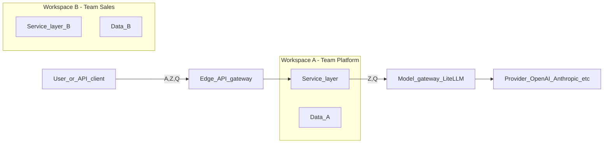
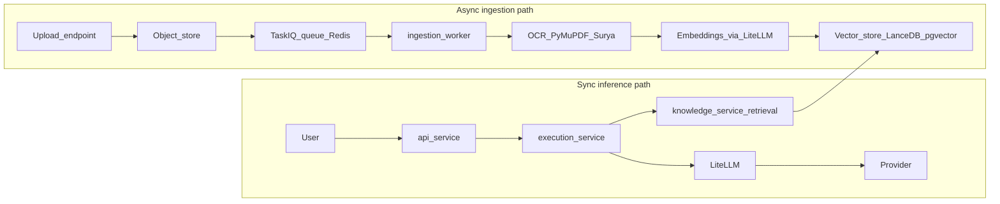
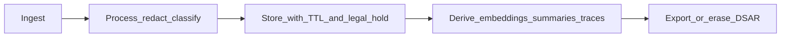
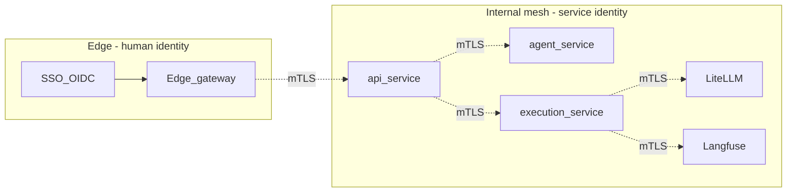
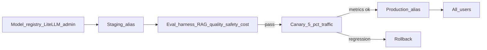
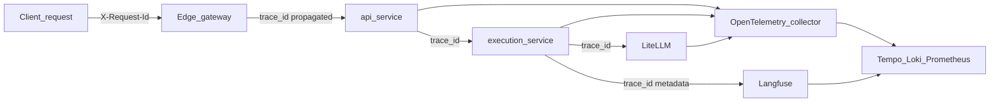

# Diagram extensions

Swimlanes, boundaries, and labels that extend the main layered architecture
view for cross-cutting concerns (multi-tenancy, data lifecycle, async vs sync
paths, service identity, model lifecycle, correlation tracing).

Each section below is one additive overlay. The mermaid blocks are reference
views; render them here or reproduce the same structure in your own docs.

---

## 1. Tenant / workspace boundary and policy enforcement

Wrap end-user resources inside a `Workspace` boundary and mark every place
where a policy is evaluated. Use three colored badges on one view:

- `A` = Authentication (who you are)
- `Z` = Authorization / RBAC (what you can do)
- `Q` = Quota / rate limit (how much you may do)

**Design notes**

- Use one rounded rectangle per workspace; never let arrows cross workspace
  boundaries except through the **Edge API gateway** or the **Model gateway**.
- Show **per-tenant** virtual keys / model allowlists at the Model gateway box.

---

## 2. Async ingestion vs synchronous inference

When the layered view shows only a single happy path, split it explicitly:

Notes:

- Annotate **SLOs** on the sync path (e.g. p95 chat ≤ 4s) and **throughput**
  on the async path (e.g. 200 docs/min sustained).
- Mark **idempotency keys** on `upload`, `queue`, and `ingest`.

---

## 3. Data lifecycle swimlane

Add a horizontal lifecycle band under the layered view:

Annotations for each store:

- `Postgres operational`: PII columns flagged, daily backup, 35-day PITR, RPO 5m / RTO 30m.
- `Postgres Langfuse`: trace TTL 90 days, monthly export to cold storage.
- `MinIO/S3`: object-lock for `audit/`, lifecycle to Glacier after 180 days.
- `Vector store`: rebuildable from sources; no PII; nightly snapshot.

---

## 4. Service identity (mTLS) east-west

Distinguish **human identity** (SSO/OIDC) at the edge from **service identity**
between internal services:

Notes:

- Label the mesh (Linkerd / Istio / consul-connect) and the certificate issuer
  (e.g. cert-manager + an internal CA).
- Mark **break-glass** access with a dashed line from an `OpsAdmin` actor into
  the mesh through a bastion / SSM Session.

---

## 5. Model lifecycle (staging, eval, promotion)

Models move through environments before they appear in production dropdowns:

Notes:

- Annotate **who** can move from staging to canary (Platform Admin) vs canary
  to prod (Platform Admin + 1 approver).
- Wire the eval harness output into the **Audit log**.

---

## 6. Correlation tracing across services

Add one `correlation_id` column on every box and one shared collector:

Notes:

- The `trace_id` injected by the gateway should equal the Langfuse `trace.id`
  used by `execution-service`, so a single ID joins **HTTP traces**,
  **logs**, and **LLM traces**.

---

## Applying overlays to the architecture

1. Start from the layered overview (`overview.md`, section 1).
2. Treat each numbered section above as an optional overlay on that view.
3. Cross-reference each overlay to the components it annotates in the overview.
4. Keep the legend (`A` / `Z` / `Q` badges, mTLS dashed line, lifecycle band)
   defined once (for example in a glossary or figure caption).
