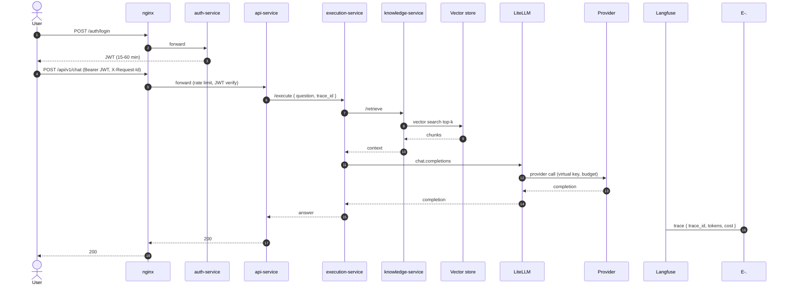
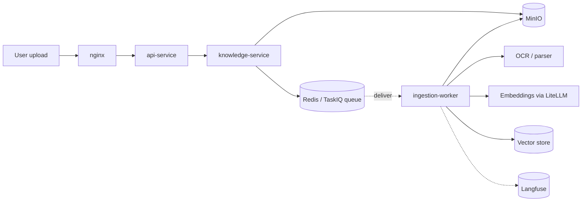

# Architecture overview

End-to-end picture of the platform as it exists in this repository today.
This file is the primary layered view; the other files in `docs/architecture/`
(`diagram-extensions.md`, `nfr.md`, `sequence-flows.md`) add overlays,
tables, and sequence-level detail.

Legend:

- Solid arrows = synchronous request/response (HTTP).
- Dashed arrows = async / message / scheduled (TaskIQ over Redis).
- Dotted arrows = telemetry/observability writes.
- Boxes named after services map 1:1 to containers in `docker-compose.yml`.

---

## 1. Layered view (six layers from the rubric)

```mermaid
flowchart TB
  %% =====================================================================
  %% 1. USER & ACCESS
  %% =====================================================================
  subgraph L1 [1 - User and Access]
    direction LR
    Users["Internal users<br/>(admin / developer / user)"]
    APIClient["API clients<br/>(scripts, integrations)"]
  end

  %% =====================================================================
  %% 2. APPLICATION / SERVICE
  %% =====================================================================
  subgraph L2 [2 - Application and Service layer]
    direction TB
    Nginx["Edge gateway<br/>nginx (eai-web)<br/>:8080"]
    SPA["React SPA<br/>(served by nginx)"]
    subgraph CorePlane [Core backend services]
      direction LR
      Auth["auth-service<br/>FastAPI<br/>JWT, RBAC, users"]
      API["api-service<br/>FastAPI + SlowAPI<br/>public API, LiteLLM proxy,<br/>telemetry rollups"]
      Agent["agent-service<br/>agents / workflows /<br/>guardrails CRUD"]
      Knowledge["knowledge-service<br/>knowledge hubs,<br/>RAG profiles"]
      Exec["execution-service<br/>chat orchestration<br/>(LangGraph-ready)"]
    end
  end

  %% =====================================================================
  %% 3. AI / PROCESSING
  %% =====================================================================
  subgraph L3 [3 - AI and Processing]
    direction LR
    LiteLLM["LiteLLM<br/>model gateway<br/>+ virtual keys + budgets"]
    Guardrails["Guardrails<br/>(NeMo Guardrails - planned)"]
    Embed["Embedding endpoints<br/>(via LiteLLM)"]
    OCR["OCR / parsing<br/>PyMuPDF, Surya<br/>(in ingestion-worker)"]
    subgraph Providers [LLM providers]
      OpenAI["OpenAI"]
      Anthropic["Anthropic"]
      OtherLLM["others..."]
    end
  end

  %% =====================================================================
  %% 4. DATA
  %% =====================================================================
  subgraph L4 [4 - Data]
    direction LR
    PG_App["Postgres :5432<br/>db = eai<br/>(users, agents, workflows,<br/>guardrails, hubs, rag_profiles,<br/>usage_daily, traces_index)"]
    PG_LiteLLM["Postgres :5432<br/>db = litellm<br/>(LiteLLM_* tables)"]
    PG_LF["Postgres-langfuse :5432<br/>db = langfuse"]
    Redis["Redis :6379<br/>sessions, queues,<br/>SlowAPI counters"]
    MinIO["MinIO :9000/:9001<br/>S3-compatible<br/>(uploads, audit)"]
    Vector["Vector store<br/>LanceDB / pgvector<br/>(planned)"]
  end

  %% =====================================================================
  %% 5. ASYNC PROCESSING
  %% =====================================================================
  subgraph L5 [5 - Async processing]
    direction LR
    Ingest["ingestion-worker<br/>TaskIQ"]
    Worker["worker-service<br/>TaskIQ<br/>(Langfuse pull, rollups)"]
    Sched["worker-scheduler<br/>TaskIQ scheduler<br/>(15 min Langfuse sync)"]
  end

  %% =====================================================================
  %% 6. PLATFORM / OBSERVABILITY / GOVERNANCE
  %% =====================================================================
  subgraph L6 [6 - Platform, Observability, Security]
    direction LR
    Langfuse["Langfuse :3003<br/>LLM traces, evals,<br/>cost / usage"]
    Audit["Audit log<br/>(MinIO object-lock)"]
    Secrets["Secrets<br/>infra/*/.env, Vault<br/>(planned)"]
    CICD["CI/CD<br/>build, test, sign<br/>(planned)"]
    IaC["IaC + GitOps<br/>(planned: K8s, Helm)"]
  end

  %% --------------------- Edges -----------------------------------------
  Users -->|HTTPS| Nginx
  APIClient -->|HTTPS + Bearer JWT| Nginx
  Nginx -->|/| SPA
  Nginx -->|/auth/*| Auth
  Nginx -->|/api/*| API

  API -->|JWT verify| Auth
  API --> Agent
  API --> Knowledge
  API --> Exec
  API -->|admin REST<br/>master key| LiteLLM
  API -.->|GET traces / metrics| Langfuse
  API --> PG_App
  API --> Redis

  Auth --> PG_App
  Agent --> PG_App
  Knowledge --> PG_App

  Exec --> Guardrails
  Exec --> Knowledge
  Exec --> LiteLLM
  Exec -.->|trace + cost| Langfuse

  LiteLLM --> Providers
  LiteLLM --> PG_LiteLLM
  Embed --> Providers

  Knowledge --> MinIO
  Knowledge --> Vector

  SPA -->|file upload| Nginx
  Nginx -->|/api/v1/uploads| API
  API -->|enqueue| Redis
  Redis -. deliver task .-> Ingest
  Ingest --> MinIO
  Ingest --> OCR
  Ingest --> Embed
  Ingest --> Vector
  Ingest -.->|trace| Langfuse

  Sched -. cron .-> Worker
  Worker -.->|GET /api/public/traces| Langfuse
  Worker --> PG_App

  Langfuse --> PG_LF

  %% Cross-cutting (governance)
  Audit -. append-only .- API
  Audit -. append-only .- Auth
  Audit -. append-only .- LiteLLM

  classDef plane fill:#0b1020,stroke:#445,color:#cfd6e4
  classDef store fill:#152033,stroke:#345,color:#cfd6e4
  classDef ai    fill:#1a2238,stroke:#456,color:#cfd6e4
  class L1,L2,L3,L5,L6 plane
  class L4 store
  class LiteLLM,Guardrails,Embed,OCR,Providers ai
```

Notes on what is **implemented today** vs. **planned**:

- Implemented: nginx edge, SPA, auth-service, api-service, agent-service,
  knowledge-service, execution-service, LiteLLM with separate `litellm` DB,
  Postgres for app + Langfuse, Redis, MinIO, TaskIQ workers and scheduler,
  Langfuse self-hosted.
- Planned (not yet implemented in this repo): NeMo Guardrails,
  LanceDB/pgvector wiring in `knowledge-service`, audit log object-lock,
  Vault, full CI/CD, K8s + IaC.

---

## 2. Request flow on the critical path (chat with RAG)

This is the same content as `sequence-flows.md` section 1, summarized so the
single-page reader sees the happy path without leaving the overview.

---

## 3. Async ingestion path

Decoupled from the chat path so a 50 MB PDF upload never starves a chat
request. See `sequence-flows.md` section 2 for the full sequence.

---

## 4. Where things live in the repo

| Component (section 1) | Path |
|---|---|
| Edge gateway (nginx) | `infra/nginx/` |
| React SPA | `apps/web/` |
| auth-service | `services/auth-service/` |
| api-service | `services/api-service/` |
| agent-service | `services/agent-service/` |
| knowledge-service | `services/knowledge-service/` |
| execution-service | `services/execution-service/` |
| ingestion-worker | `services/ingestion-worker/` |
| worker-service / scheduler | `services/worker-service/` |
| LiteLLM config | `infra/litellm/` |
| Langfuse env | `infra/langfuse/` |
| Postgres init (3 DBs: eai / langfuse / litellm) | `infra/postgres/init/01-init.sql` |
| Shared Python utilities | `libs/python/eai_common/` |
| Compose stack | `docker-compose.yml` |

---

## 5. Companion documents

Read alongside this overview:

- `docs/architecture/diagram-extensions.md` — overlays for tenancy, async vs
  sync paths, data lifecycle, mTLS, model lifecycle, and correlation tracing.
- `docs/architecture/nfr.md` — SLO, RPO/RTO, retention, security, capacity,
  environment matrix.
- `docs/architecture/sequence-flows.md` — three end-to-end sequence flows
  (chat with RAG, document ingestion, admin model change with audit).
