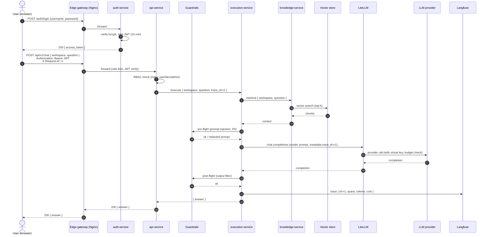
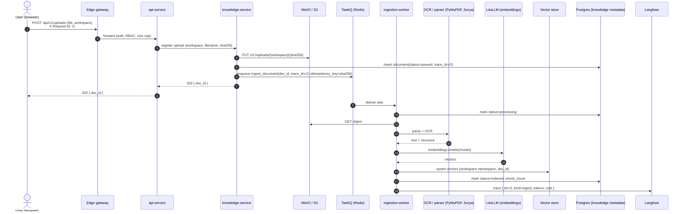
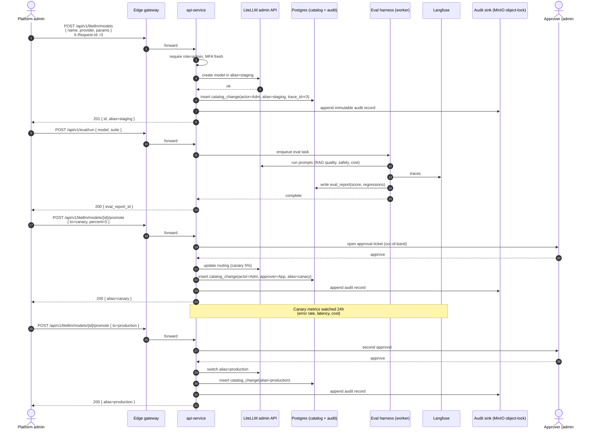

# Sequence flows

Three end-to-end flows that the layered diagram does not show on its own.
Together they prove the platform handles **synchronous chat with retrieval**,
**asynchronous ingestion**, and **governed admin changes**.

Every flow propagates a single `trace_id` (the gateway's `X-Request-Id`)
across services so logs, HTTP traces, and Langfuse traces can be joined.

---

## 1. Authenticated chat with RAG

User asks a question through the web portal; the platform retrieves context
from the workspace knowledge hub, calls an LLM via LiteLLM, records the trace
in Langfuse, and returns the answer.

Failure / degradation notes:

- If `knowledge-service` or vector store is down, `execution-service` falls
  back to **no-context** mode and tags the trace `degraded=retrieval_off`.
- If LiteLLM rejects (budget exceeded), `api-service` returns `429` with a
  workspace-friendly message.
- If Langfuse is unreachable, the trace is buffered locally for 1 h before
  being dropped; user traffic is never blocked on telemetry.

---

## 2. Document upload and indexing

User uploads a file; the platform stores it in object storage, queues an
ingestion task, extracts text, generates embeddings, and writes vectors back
to the workspace index.

Notes:

- The `idempotency_key` is the file's `sha256`; replays of the same upload
  are no-ops and never double-charge.
- The user can poll `GET /api/v1/uploads/{doc_id}` (served by `knowledge-service`
  via `api-service`) to see `queued → processing → indexed` or `failed`.
- Failures move the task to a dead-letter queue; the SPA shows a "retry"
  button that re-enqueues with the same idempotency key.

---

## 3. Admin model change with audit and canary

A platform admin promotes a new provider/model into the catalog. The change
is governed: it requires elevated role, lands in **staging** first, runs the
eval harness, optionally canaries, and only then becomes visible to all
workspaces. Every step is auditable.

Notes:

- Every transition (`staging → canary → production`) requires a second admin
  approval and is appended to the **object-locked** audit bucket; rollback
  is a single API call that flips the alias and writes another audit record.
- If canary metrics regress (Langfuse-derived error rate or p95), the
  `worker-service` watcher posts a warning to the admin and disables the
  promote endpoint until acknowledged.
- End users never see staging or canary models unless their workspace is
  explicitly opted in via virtual-key tags.

---

## How to use these in the submission

1. Each section above maps to one **page** in the draw.io file
   (`Sequence: Chat`, `Sequence: Upload`, `Sequence: Admin model change`).
2. Keep the same actor/participant naming as the main layered diagram so
   reviewers can trace boxes back to layers.
3. The `X-Request-Id` / `trace_id` annotation is the bridge between this file
   and `diagram-extensions.md` (section 6, correlation tracing).
